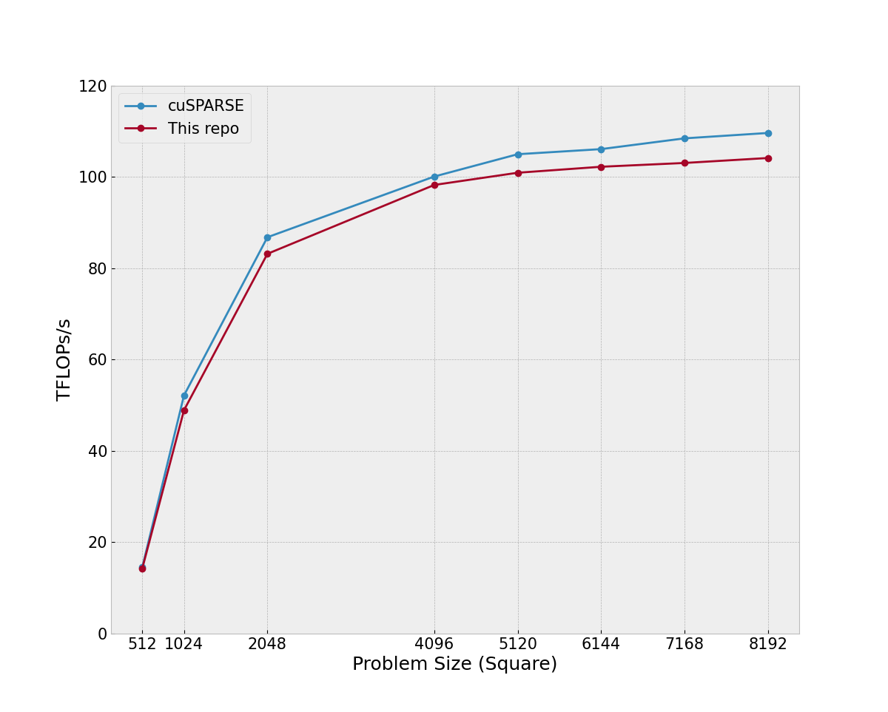

# A high performance 2:4 Sparse GEMM

A self contained high-performance 2:4 sparsity tensorcore GEMM with comparable performance to cuSPARSE on large problem sizes (4096x4096x4096). Companion code for my post [Implementing a 2:4 Sparse GEMM Kernel with Tensor Cores](https://benfattori.com/overview-of-a-24-sparse-gemm/)

## Setup

If you have Docker, the easiest way to get setup is with the provided image. To start the container and run it in detached mode:

```bash
docker compose build 
docker compose up -d 
```
From here, you can connect through VS Code if you have the "Dev Containers" extension. 

If you don't want to use Docker, a machine with the following setup should suffice:

- gcc 11.4.*
- nvcc 12.6.3
- cuSPARSELt 0.8.1
- ubuntu 22.04


## Build Instructions

Build the code with:

```bash
make gemm
```

The binary will be located under `build`.

## Benchmarking

The benchmark script can be used as follows:

```bash
./build/gemm $M $N $K $benchmark $check_correctness $benchmark_cusparselt
```

To benchmark a 4096x4096x4096 GEMM and check for correctness against a CPU implementation:

```bash
./build/gemm 4096 4096 4096 1 1 0
```

To run both the custom kernel and cuSPARSELt benchmarks for comparison:

```bash
./build/gemm 4096 4096 4096 1 0 1
```

For benchmarking, we use the following settings to lock the GPU clocks. These values are for an RTX 4070, you will have to look up the GPU and Memory clocks for your own device online:

```bash
sudo nvidia-smi -pm ENABLED
sudo nvidia-smi --lock-gpu-clocks=2475
sudo nvidia-smi --lock-memory-clocks=10501 
```

## Results

This kernel was primarily tuned for a 4096x4096x4096 GEMM. At this size, it achieves 98% the throughput of cuSPARSE. 


At larger and smaller GEMM sizes, we lose some performance due to cuSPARSE being able to select across many different kernel configurations, at worst we achieve 94% the throughput of cuSPARSE with an 8192x8192x8192 GEMM.


